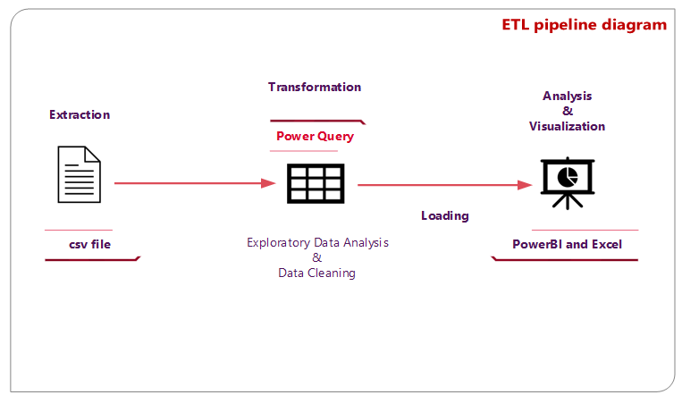
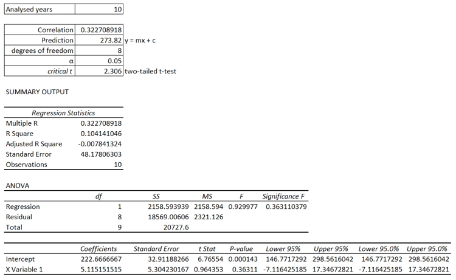
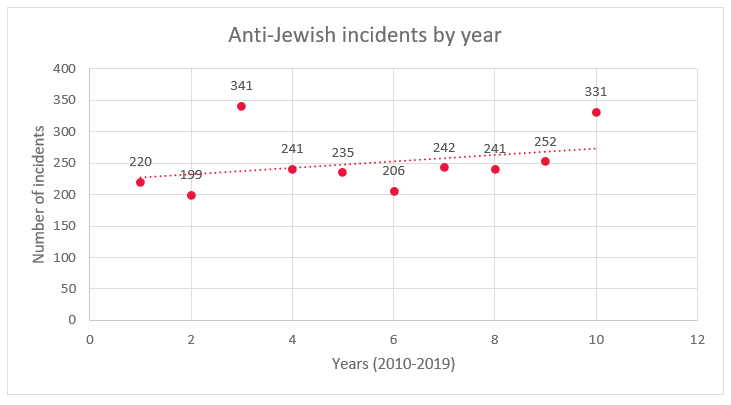
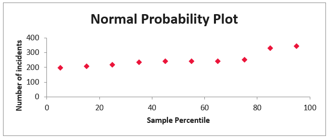
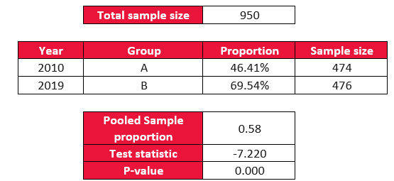
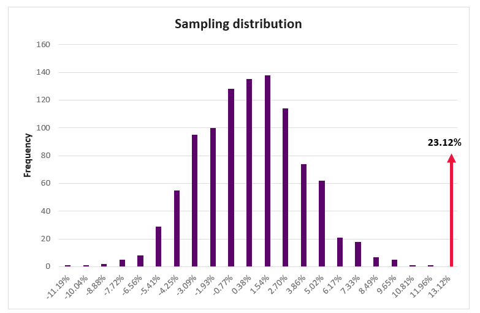

# Summative assessment
# Data Science Project

## Executive summary
The project aimed to investigate if Anti-Jewish hate crimes in New York state increased between 2010 and 2019. By analysing the trend through linear regression and produce and AB testing between the incidents in 2010 and 2019, we determined that Anti-Jewish hate crimes have a positive trend not caused by random variation. The model will be extended to the following years and potential outliers will be further studied.

## Data Source and Preparation
The New York state hate crime data from 2010 to 2019 (Kaggle 2019) was obtained from the website Kaggle and sourced from the New York Division of Criminal Justice Services by a site user. 

As shown in the Extraction Transformation Loading (ETL) pipeline above, the dataset was extracted from a csv file, ingested by Power BI’s Power Query to assess its data quality and action any improvements.
An Exploratory Data Analysis (EDA) was performed by viewing the column distribution and column quality in Power Query, we primarily focused on following the six dimensions of quality of data (Government Data Quality Hub 2021):

-	Completeness: Records exist for every field with no null values, but it appears the counties of Wyoming and Yates have been aggregated into one county called “Multiple”.
-	Uniqueness: No duplicated records have been found.
-	Consistency: No values contradict others, including formatting.
-	Timeliness: We trust the data has been updated to accurately reflect the period.
-	Validity: All values appear on the range and format expected except for one crime type registered as “Recode me”, value has been changed to “Other”.
-	Accuracy: No values indicate the data does not match reality. No errors or outliers have been found.
-	User needs: This study focuses on the number of incidents per year, thus changes on minor counties and crime types as above are a valid trade-off. Also, the naming of fields is easy to understand, and no changes were made to them.
  
Following the transformations mentioned above and the quality audit, the data was loaded into Power BI and Excel for analysis. Excel was chosen to provide additional information about the data.
Steps to ensure data privacy will not be required as this database has already been anonymised by the source.

## Analysis Documentation
The methods used are linear regression to analyse trends and A/B testing to compare the number of incidents in 2010 and 2019. Using both methods together is helpful because linear regression gives a simple comprehensive view of the trend, while A/B testing can validate the results of the regression analysis (Bruce, P., Bruce, A. and Gedeck, P. 2017).

Figure 2 shows the regression statistic results taken from excel, including a prediction for 2019, and Figure 3 shows a scatterplot plotted with a linear regression for the analysed values.
On a first look, the regression line displays a mild upward trend and appears to be a good fit of most values with exception of the figures in 2012 and 2019. These two years may be outliers due to their unusually high values and deviation from the regression line, but they will be included in our study as there is no evidence of inaccuracies, and their values are not extreme enough to be deemed invalid.

An F-significance below 0.05 and a p-value below 0.01 provide strong evidence against the hypothesis that there is no relationship between both variables at a 99% significance level.
On the other side, a positive correlation coefficient indicates a positive relationship between the x-variable and y-variable, supporting the hypothesis that anti-Jewish hate crimes might have an upwards trend between 2010 and 2019.

These results assume a normal distribution of the data, however the sudden increase of the 85th percentile and the 95th percentile in the Normal probability plot suggest potential skewness or the presence of outliers.

Moving on to the A/B testing, we have an observed difference of 23.12% between the Anti-Jewish incidents registered in 2010 (220) and 2019 (331).

Null hypothesis: The number of Anti-Jewish incidents were the same in 2010 and 2019. H0: p1 =p2

Alternative hypothesis: The number of Anti-Jewish incidents were not the same in 2010 and 2019. H1: p1≠p2

Since the p-value is below 0.01, it can be determined there is strong evidence against the null hypothesis at the 99% significance level.

A bootstrap sampling graph has been created to study the consistency of the conclusion drawn from the previous AB testing where the same test is replicated for 1,000 iterations.

The resamples yielded a range of differences between -11.19% and +11.96% with an approximately normal distribution.

The extreme difference between this observed difference and the resampled differences indicates the difference between anti-Jewish incidents cannot be attributed to random variations. However, the high frequencies are located roughly between -0.77% and 2.70%, suggesting a positive trend between 2010 and 2019.

In conclusion, linear regression and bootstrap sampling support the theory of Anti-Jewish hate crimes increasing between 2010 and 2019, but A/B testing reveals that the figures in 2019 might have been skewed by an occurrence and not caused by random variation.

## Conclusion
In conclusion, our analyses suggested Anti-Jewish hate crimes increased between 2010 and 2019. Considering the figures in 2012 and 2019 skewed our results, our future studies should investigate the causes behind these variations.

Parameters delimiting hate crimes are subjective, often influenced by individuals recording incidents. Moreover, biases such as selection biases (Kangralkar, S. 2023) may have influenced how the data was collected by the data source. To address this issue, an improvement could be ensuring every district representative of minorities is included in the dataset.

From an ethical perspective, the topic of hate crimes demands careful handling to ensure integrity and accuracy of findings. It is crucial that every statement is justified by reliable data to avoid misrepresentation and misinformation.

## References Bibliography
Bruce, P., Bruce, A. and Gedeck, P. (2017) Practical statistics for Data scientists. O’Reilly Media, Inc.

Devitt, J. (2021) America more liberal than 50 years ago-but change not reflected in its politics, NYU. Available at: https://www.nyu.edu/about/news-publications/news/2021/december/america-more-liberal-than-50-years-ago-but-change-not-reflected-.html (Accessed: 01 August 2024).

Government Data Quality Hub (2021) What is data quality?, GOV.UK. Available at: https://www.gov.uk/government/news/what-is-data-quality (Accessed: 01 August 2024).

Kangralkar, S. (2023) Types of biases in data, Medium. Available at: https://towardsdatascience.com/types-of-biases-in-data-cafc4f2634fb (Accessed: 01 August 2024).

Kuznetsova, A. (2023) Gestalt principles in Data Visualization, Medium. Available at: https://nastengraph.medium.com/gestalt-principles-in-data-visualization-a4e56e6074b5 (Accessed: 01 August 2024).

Lidman, M & Nyberg, J (2023) Accessible Analytic Dashboards. Available at: http://hdl.handle.net/20.500.12380/306747 (Accessed: 01 May 2024).

## Appendix
Kaggle (2019). New York Division of Criminal Justice Services sourced by Kaggle user. US Hate Crime Dataset 2010-2019 (Multiple Sources). Available at: https://www.kaggle.com/datasets/sumaiaparveenshupti/us-hate-crime-dataset-20102019-multiple-sources (Accessed: 01 July 2024)

